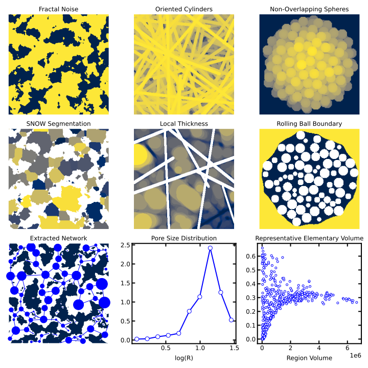

.. _front_page:

.. module:: porespy
   :noindex:

.. image:: ./_static/images/porespy_logo.jpg
   :name: banner

###############################################
Quantitative Image Analysis of Porous Materials
###############################################

What is PoreSpy? |stars|
########################

PoreSpy is a collection of image analysis functions used to extract information
from 3D images of porous materials (typically obtained from X-ray
tomography). There are other packages that offer generalized image analysis
tools (i.e ``skimage`` and ``scipy.ndimage`` in the Python environment, ImageJ,
MatLab's Image Processing Toolbox), but they all require building up
complex scripts or macros to accomplish tasks of specific use to porous
media. Porespy includes predefined functions to accomplish many of these
routine analyses rapidly and conveniently.

----

Capabilities
############

PoreSpy consists of the following modules:

-  ``generators``: Routines for generating artificial images of porous
   materials useful for testing and illustration
-  ``filters``: Functions that accept an image and return an altered
   image
-  ``metrics``: Tools for quantifying properties of images
-  ``networks``: Algorithms and tools for analyzing images as pore
   networks
-  ``simulations``: Functions for performing physics-based simulations on
   images
-  ``tools``: Various useful tools for working with images
-  ``visualization``: Helper functions for creating useful views of the
   image
-  ``io``: Functions for outputting image data in various formats for
   use in common software

.. toctree::
   :hidden:
   :maxdepth: 0

   installation
   basic_usage
   modules/index
   _examples/index

Gallery
#######

----

How To Cite
###########

If you use PoreSpy in a publication, please add the following citation:

.. admonition:: Citation

    Gostick J, Khan ZA, Tranter TG, Kok MDR, Agnaou M, Sadeghi MA,
    Jervis R. PoreSpy: A Python Toolkit for Quantitative Analysis of
    Porous Media Images. *Journal of Open Source Software*, 2019.
    `doi:10.21105/joss.01296 <https://doi.org/10.21105/joss.01296>`_

.. |stars| image:: https://img.shields.io/github/stars/PMEAL/porespy.svg?style=social&label=Star&maxAge=2592000
   :target: https://GitHub.com/PMEAL/porespy/stargazers/
